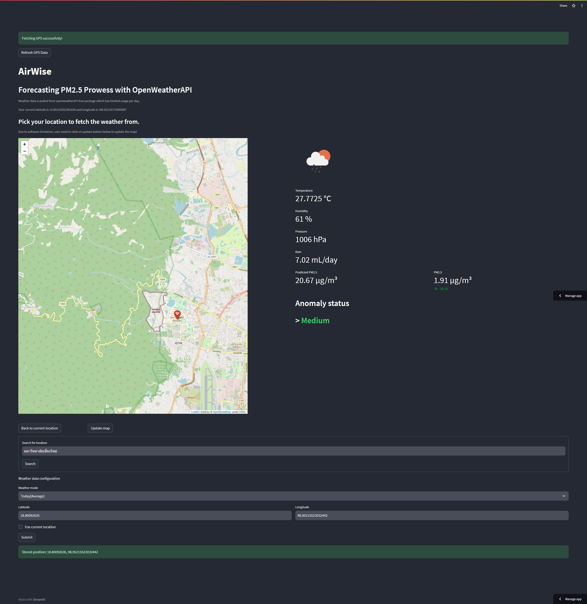

<br/>
<p align="center">
  <a href="https://github.com/thunni-noi/CMU-AirWise">
    
  </a>

  <h3 align="center">AirWise</h3>

  <p align="center">
    Forecasting PM2.5 Prowess with OpenWeatherAPI
    <br/>
    <br/>
  </p>
</p>

   
[](https://cmu-airwise-heeudbkgeglffcw65qk6u9.streamlit.app/)

## Table Of Contents

* [เกี่ยวกับโปรเจกต์นี้](#เกี่ยวกับโปรเจกต์นี้)
* [การใช้งาน](#การใช้งาน)
  * [การรันบนเครื่อง Local](#การรันบนเครื่อง Local)

## เกี่ยวกับโปรเจกต์นี้



โปรเจกต์นี้เป็นส่วนหนึ่งของ Data Science Project Contest 2023 ซึ่งทางมหาวิทยาลัยเชียงใหม่ได้จัดขึ้นโดยให้ชุดข้อมูลสภาพอากาศมาแล้วให้ผู้เข้าแข่งขันนำไปต่อยอด ซึ่งโปรเจกต์นี้เป็นการนำข้อมูลสภาพอากาศมาเพื่อพยากรณ์ฝุ่น PM2.5 ที่อาจเกิดขึ้น


## การใช้งาน

การใช้งานสามารถใช้งานได้บน Streamlit ด้านบน หรือหากต้องการรันบนเครื่องแบบ Local ให้ทำตามขั้นตอนต่อไปนี้

### การรันบนเครื่อง Local

ติดตั้ง Library ที่ต้องใช้
```
pip install -r requirements.txt
```

1. ในการจะรันได้จำเป็นต้องมี [OpenWeather API ประเภท One Call API](https://home.openweathermap.org/subscriptions) ซึ่งสามารถใช้ได้ฟรี 1000 request ต่อวัน
2. สร้างไฟล์ ```secrets.toml``` ในโฟลเดอร์ ```.streamlit```
3. ในไฟล์ ```secrets.toml``` ต้องประกอบด้วย
```
openweather_api = "{API ของคุณ}"
current_platform = "pc"
```
4. รันด้วยคำสั่ง ```streamlit run main.py```
